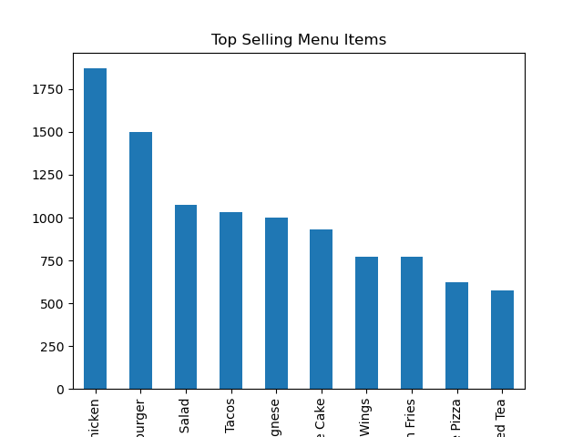
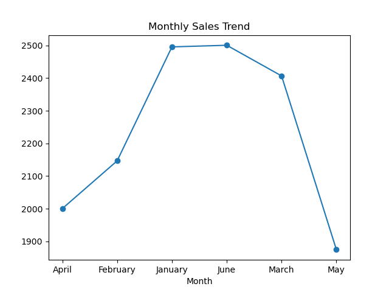
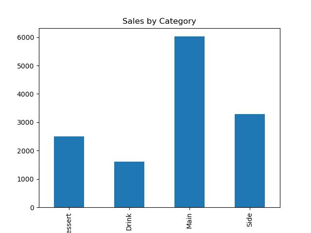
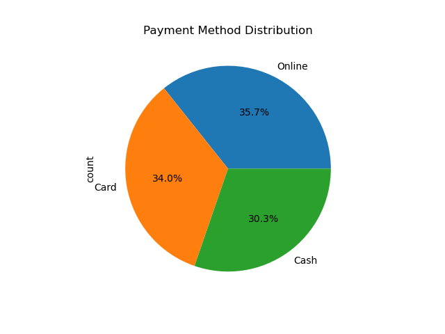
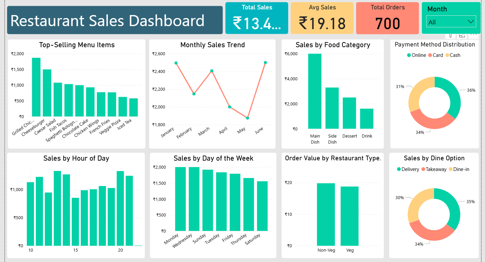

# 🍽️ Restaurant Sales Data Analysis

---

# 📌 Overview

This project focuses on analyzing restaurant sales data using Python, SQL, and Power BI to uncover valuable business insights and customer purchasing patterns.

The project includes:
- Data Cleaning & Preprocessing
- Exploratory Data Analysis (EDA)
- SQL-based Sales Analysis
- Interactive Power BI Dashboard
- Data Visualization using Matplotlib
- Business KPI Analysis

The main objective of this project is to help restaurant businesses understand sales performance, customer behavior, payment trends, and top-performing products to support better business decisions.

---

# 🎯 Objectives

- Analyze total restaurant sales revenue
- Identify top-selling menu items
- Analyze monthly sales trends
- Identify category-wise sales performance
- Analyze customer payment methods
- Identify peak sales days and peak business hours
- Compare sales across dine types (Delivery, Dine-In, Takeaway)
- Generate business insights using SQL and Python
- Create an interactive Power BI dashboard for business reporting

---

# 📂 Dataset

The dataset used in this project contains restaurant sales transaction details used for analyzing customer purchasing behavior, sales trends, and business performance.

- **Dataset Name:** Restaurant Sales Dataset
- **Source:** Kaggle
- **Records:** 700+ Orders
- **Tools Used:** Python, SQL, Power BI, Jupyter Notebook

This dataset provides structured information about restaurant transactions including menu items, sales revenue, payment methods, customer order patterns, and dine types.

---

# 📋 Columns Included

- Order_ID
- Item_Name
- Category
- Quantity
- Price
- Total_Sale
- Payment_Method
- Dine_Type
- Date
- Month
- Day_Name
- Hour

---

# 📌 Dataset Features

The dataset helps analyze:

- Sales performance
- Customer purchasing behavior
- Top-selling menu items
- Revenue trends
- Category-wise performance
- Payment method distribution
- Peak business hours
- Dine-In vs Delivery analysis

---

# 🛠️ Tools & Technologies Used

- Python
- Pandas
- NumPy
- Matplotlib
- SQL (MySQL)
- Power BI
- Jupyter Notebook

---

# 🗂️ Schema

```sql
CREATE TABLE sales (
    Order_ID VARCHAR(20),
    Item_Name VARCHAR(100),
    Category VARCHAR(50),
    Quantity INT,
    Price DECIMAL(10,2),
    Total_Sale DECIMAL(10,2),
    Payment_Method VARCHAR(50),
    Dine_Type VARCHAR(50),
    Date DATE,
    Month VARCHAR(20),
    Day_Name VARCHAR(20),
    Hour INT
);
```

---

# 🔍 Python Exploratory Data Analysis (EDA)

Performed data cleaning, analysis, and visualization using Python libraries such as Pandas and Matplotlib.

The following analyses and visualizations were created:

- Total Sales Analysis
- Total Orders Analysis
- Average Sales Analysis
- Top Selling Menu Items
- Monthly Sales Trend
- Sales by Category
- Payment Method Distribution
- Sales by Day
- Sales by Dine Type

---

## 📈 Top Selling Menu Items



---

## 📈 Monthly Sales Trend



---

## 📈 Sales by Category



---

## 📈 Payment Method Distribution



---

# 📊 Power BI Dashboard

An interactive Power BI dashboard was developed to analyze restaurant sales performance, customer ordering patterns, and revenue trends.

The dashboard includes:

- Total Sales KPI
- Average Sales KPI
- Total Orders KPI
- Monthly Sales Trend
- Top-Selling Menu Items
- Sales by Food Category
- Payment Method Distribution
- Sales by Hour of Day
- Sales by Day of the Week
- Sales by Dine Option

---

## 📈 Dashboard Overview



---

# 📌 Dashboard Features

- Interactive slicers and filters
- Business KPI tracking
- Trend analysis
- Customer payment analysis
- Product performance analysis
- Restaurant sales monitoring

---

# 📌 Dashboard Insights

- Grilled Chicken was the top-selling menu item
- Main Dish category generated highest revenue
- Online payment was the most preferred payment method
- Peak sales were observed during evening hours
- Delivery orders contributed significantly to total sales
- Monday generated the highest weekly sales

---

# 🗄️ Business Problems & SQL Queries

---

## 1. Calculate Total Restaurant Sales Revenue

```sql
SELECT SUM(Total_Sale)
FROM sales;
```

### Objective:
Calculate the overall revenue generated by the restaurant.

---

## 2. Identify Top Selling Menu Items

```sql
SELECT Item_Name, SUM(Total_Sale)
FROM sales
GROUP BY Item_Name
ORDER BY SUM(Total_Sale) DESC
LIMIT 10;
```

### Objective:
Identify the highest revenue-generating menu items.

---

## 3. Analyze Sales by Food Category

```sql
SELECT Category, SUM(Total_Sale)
FROM sales
GROUP BY Category;
```

### Objective:
Analyze category-wise sales performance to identify best-performing food categories.

---

## 4. Analyze Payment Method Distribution

```sql
SELECT Payment_Method, COUNT(*)
FROM sales
GROUP BY Payment_Method;
```

### Objective:
Understand customer payment preferences such as Online, Card, and Cash payments.

---

## 5. Identify Highest Sales Day

```sql
SELECT Day_Name, SUM(Total_Sale) AS Total_Revenue
FROM sales
GROUP BY Day_Name
ORDER BY Total_Revenue DESC;
```

### Objective:
Identify which day generated the highest restaurant revenue.

---

## 6. Analyze Peak Sales Hours

```sql
SELECT Hour, SUM(Total_Sale) AS Total_Revenue
FROM sales
GROUP BY Hour
ORDER BY Total_Revenue DESC;
```

### Objective:
Determine peak customer ordering hours and busiest business periods.

---

## 7. Compare Revenue by Dine Type

```sql
SELECT Dine_Type, SUM(Total_Sale) AS Revenue
FROM sales
GROUP BY Dine_Type;
```

### Objective:
Compare sales performance between Delivery, Dine-In, and Takeaway services.

---

## 8. Calculate Average Order Value

```sql
SELECT AVG(Total_Sale) AS Average_Order_Value
FROM sales;
```

### Objective:
Calculate the average amount spent per customer order.

---

# 📊 Key Insights

- Generated total sales revenue of 13,000+
- Analyzed 700+ restaurant orders
- Main Dish category generated highest revenue
- Online payment method was most frequently used
- Grilled Chicken and Cheeseburger were top-selling menu items
- Delivery service generated high sales contribution
- Peak sales were observed during specific business hours
- Monday generated highest weekly sales

---

# ✅ Conclusion

This project successfully analyzed restaurant sales data using Python, SQL, and Power BI to generate meaningful business insights. The analysis helped identify customer trends, revenue patterns, and operational opportunities that can support better restaurant business decisions.

---

# 👩‍💻 Author

Roshini R
This project is part of my portfolio, demonstrating practical SQL skills used in real-world data analysis.
```
